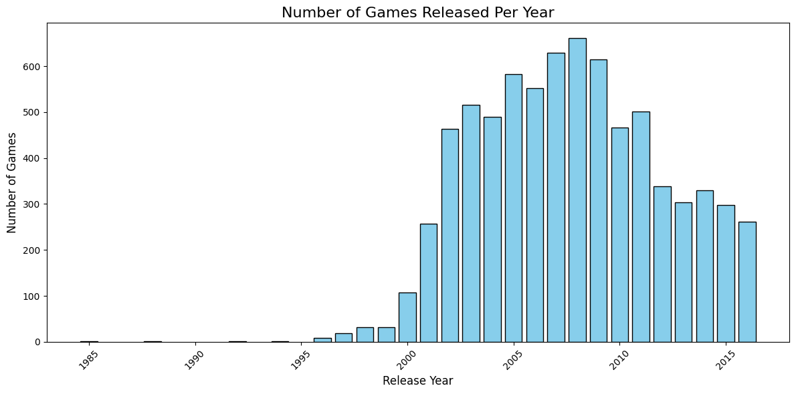

# TripleTen Project: Game Sales Forecasting 

## Table of Contents

- [Objective](#objective)
- [Overview](#overview)
- [Tools](#tools)
- [Highlights](#highlights)
- [Results](#results)
- [Recommendations](#recommendations)
- [Contact](#contact)
---

### Objective 
- Analyzed video game sales, reviews, genres, and platform data from Ice's online store to identify key factors influencing game success and to support 2017 advertising campaign planning through data-driven insights.
---

###  Overview
- In this project we will reivew the historical data on game sales from various platforms. 
- First, we will prepare the data and fix any necessary changes to create an accurate data base. This includes, replacing the columns names to lower case, convert data to the required types, fix missing and/or duplicated values, and lastly calculating the total sales for each game. 
- Second, we will analyze the data through various EDA concepts and create visuals of our data that will help us draw conclusions later on. 
- Next, we will test the hpothesis of average user ratings from platforms and game genres. 
- Lastly, we will draw conclusions of our analysis and hypotheiss testing. 

---

###  Tools

- Python (Pandas, NumPy, Scikit-learn)
- Matplotlib / Seaborn
- Jupyter Notebook
- import numpy as np
- import pandas as pd
- import matplotlib.pyplot as plt
- import seaborn as sns
- from scipy import stats
- from scipy.stats import ttest_ind

---

### Highlights

Above we have a table that shows the year and the number of games released for that year. Year after year we can see the numer of games released increase exponentially. This may be due to the dot com in the early two thousands and the release of newer technology. 

There is a significant differnece in sales from in the first ten platforms listed on the x-axis compared to the last ten. The global sales drops off from 20 million to 10 million from the start of "PSP" platform on the x-axis to the end at "WS". 

---

### Results

T-test Results:
T-statistic: 1.57746791633354
P-value: 0.11483818791498286

Based on the p-value being much greater than 0.05, there is no statistically significant difference between the average user ratings for the Action and Sports genres.

We fail to reject the null hypothesis, which means the average ratings for Action and Sports genres are statistically similar.

---

### Recommendations

Based on the project objectives we were able to accomplish the following: 
    
1. Prepare the data:

- We were able to make the correct changes to create an accurate data base. 

- Fix any missing values with explanations as to why they are missing. 

- Calculate the total sales for each game. 

- Checked for dupicate data values. 

2. Analyze the data: 

- We took a deep dive into the platforms and found which ones had the greatest sales. 

- Built box plots to visually display the data and give a detailed insight about our analysis. 

- We also saw trends of how reviews affected the sales of of a popular platform. 

- Added pie charts to visually show the trend betwen genres for the Wii gaming platform. 

3. Created a profile for the three regions (NA, EU, JP): 

- Calculated the top five platforms for each region. 

- Calculated the top five genres for each region. 

- Added three bar charts that visually showed the data values. 

4. Hypothesis Testing:

- Tested a hypothesis for the relaitonship between the average user ratings of the Xbox One and PC platforms are the same. 

- Tested the hypothesis for the relationship between the average user ratings for the Action and Sports genres are different.
        
This report is beneficial for anyone who is in the gaming industry and wants to udnerstand more about the global sales of a variety of games. In addition, the report will give a insight on the different gaming genres and the trends the vary from different gaming platforms year over year. 

--- 
### Contact

