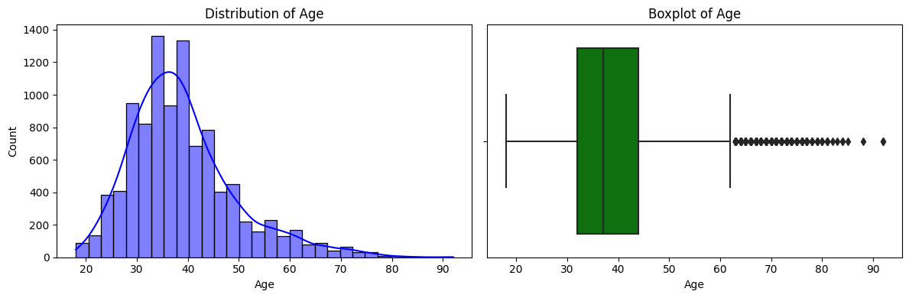
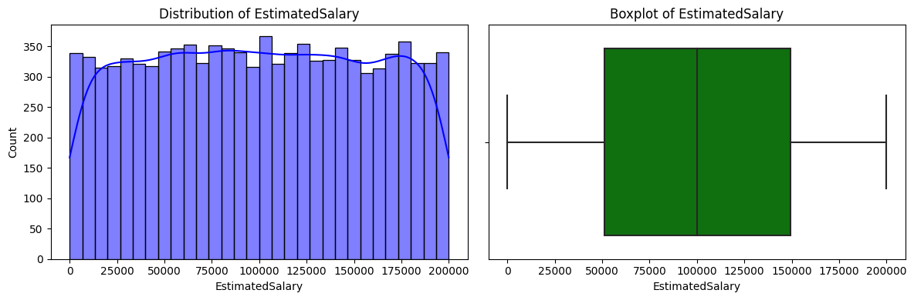
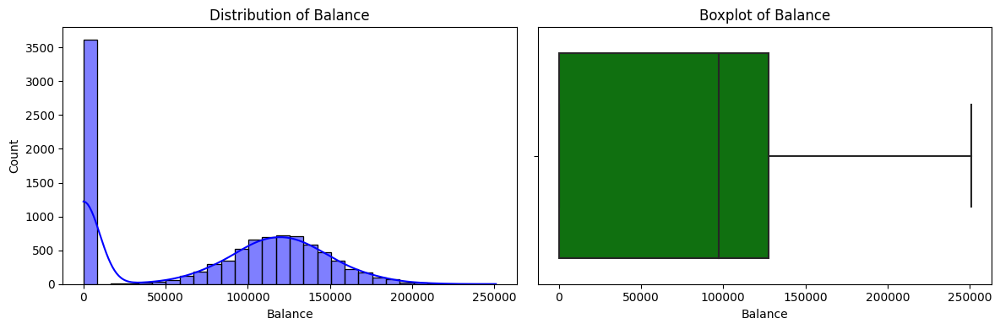
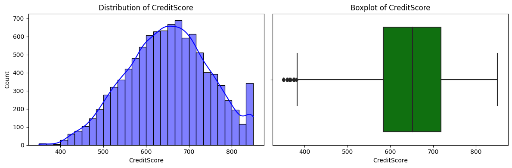

# TripleTen Project: Beta Bank Customers

## Table of Contents

- [Objective](#objective)
- [Overview](#overview)
- [Tools & Libraries](#tools)
- [Highlights](#highlights)
- [Results](#results)
- [Recommendations](#recommendations)
- [Contact](#contact)
---

### Objective   
- Built a machine learning model to predict whether customers would leave a bank based on behavioral and demographic data.
---

###  Overview
- Beta Bank is experiencing a decline in its customer base, in need of a retnetion strategy. Using the existing data from customers is more cost-effective than acquiring new ones, the bank wants to predict which customers are likely to leave.
- By using historical data on client behavior and contract termination, our goal is to build a machine learning model taht maximizes the F1 score. An F1 score of at least a 0.59 is the goal.  

---

### Tools

- Python (Pandas, NumPy, Scikit-learn)
- Matplotlib / Seaborn
- Jupyter Notebook
- from sklearn.model_selection import RandomizedSearchCV
- from sklearn.utils import resample
- from sklearn.linear_model import LogisticRegression
- from sklearn.metrics import roc_curve, auc
- from sklearn.utils.class_weight import compute_class_weight
- from sklearn import tree
- from sklearn.metrics import f1_score, roc_auc_score, classification_report, confusion_matrix
- from sklearn.model_selection import train_test_split
- from sklearn.metrics import mean_squared_error, r2_score
- from sklearn.preprocessing import StandardScaler
- from sklearn.ensemble import RandomForestClassifier
- from sklearn.model_selection import GridSearchCV
- from sklearn.preprocessing import LabelEncoder
- from sklearn.utils.class_weight import compute_class_weight
- import matplotlib.pyplot as plt %matplotlib inline
- import seaborn as sns
- from sklearn import metrics
- from xgboost import XGBClassifier
- import pandas as pd
- import numpy as np

---

### Highlights

The Age distribution appears right-skewed, indicating fewer older customers. Some outliers exist at the higher end.

EstimatedSalary is fairly evenly distributed, suggesting a uniform salary range among customers.

Many customers have a zero balance, indicating a potential pattern in how bank accounts are maintained.

CreditScore is approximately normally distributed, with a slight concentration around higher scores.

---

### Results

Final Test Set F1 Score: 0.5942

Final Test Set AUC-ROC Score: 0.7270

---

### Recommendations

The machine learning model successfully predicts customer churn, with a Final Test Set F1 Score of 0.5942, meaning it does a good job balancing precision and recall. The AUC-ROC Score of 0.7270 shows that the model can distinguish between customers who are likely to leave and those who will stay. This is useful for Beta Bank because it allows them to focus on high-risk customers and take action, like offering special deals or improving customer support, to keep them from leaving. While the model performs well, there’s still room for improvement by fine-tuning features, optimizing hyperparameters, and analyzing misclassified cases to make predictions even more accurate.

### Contact
### Liam Easter
---

