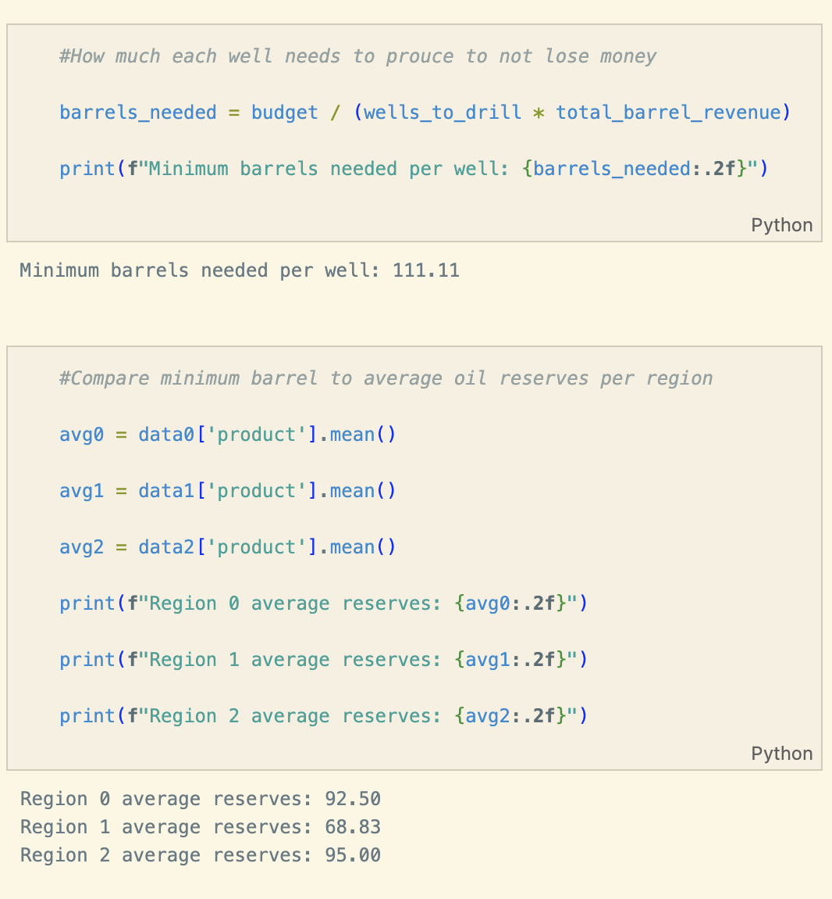

# TripleTen Project: Oily Giant Mining Company

## Table of Contents

- [Objective](#objective)
- [Overview](#overview)
- [Tools](#tools)
- [Highlights](#highlights)
- [Results](#results)
- [Recommendations](#recommendations)
- [Contact](#contact)
---

### Objective   
- Develope a predictive model using oil well data from three regions to identify the most profitable location for a new well, estimating reserve volumes and analyzing potential profit and risk with Bootstrapping.
---

###  Overview

- OilyGiant mining company is trying to find the best place for a new well. 
- In order to find the best location, we will have to perform the following; collect the woil well parameters, build a model for predicting the volume of reserves in the new wells, pick the oil wells with the hghest estiamged calues, and pick the region with the highest total profile margin. 
- By using the bootstrapping technique we will be able to analyze the potaitnal profit and rsiks for choosing the right oil region. 
 

---

### Tools

- Python (Pandas, NumPy, Scikit-learn)
- Matplotlib / Seaborn
- Jupyter Notebook
- import pandas as pd
- import numpy as np
- import seaborn as sns
- import matplotlib.pyplot as plt
%matplotlib inline
- from sklearn.linear_model import LinearRegression
- from sklearn.metrics import roc_curve, auc
- from sklearn.utils.class_weight
- import compute_class_weight
- from sklearn import tree
- from sklearn.metrics import f1_score, roc_auc_score, classification_report,confusion_matrix
- from sklearn.model_selection import train_test_split
- from sklearn.metrics import mean_squared_error
- from sklearn.preprocessing import StandardScaler
- from sklearn.ensemble import RandomForestClassifier
- from sklearn.preprocessing import LabelEncoder
- from sklearn import metrics
- from xgboost import XGBClassifier

---

### Highlights

The minium number of barrells needed for each well is at least 111.11. We used the mean of each data set to compare minimum barrel to average oil reserves per region.

### Results

Region 0:
 Average Profit: $4027065.30
 95% Confidence Interval: $-962,478.94 to $8,898,624.95
 Risk of Loss: 4.80%

Region 1:
 Average Profit: $4487290.37
 95% Confidence Interval: $458,001.97 to $8,324,694.77
 Risk of Loss: 2.20%

Region 2:
 Average Profit: $3801587.77
 95% Confidence Interval: $-1,286,135.66 to $8,600,086.00
 Risk of Loss: 6.20%

---

### Recommendations

Based on the results, Region 1 seems like the best option because it has the highest average profit of 4.49 million and the lowest risk of lost of 2.20 percent. Region 0 may be a good choice, but its average profit was lower calculating at 4.03 million and the risk of loss was higher of 4.80 percent. Region 2 appeared to be the rickiest, with the lowest average profit of $3.8 million and the highest risk of loss of 6.20 percent, making it the worst option for Oily. 

Overall, Region 1 would be the safest investment for stakeholders and investers giving the highest return with the lowest risk. The region to avoid would be Region 2. 

### Contact
### Liam Easter
---

