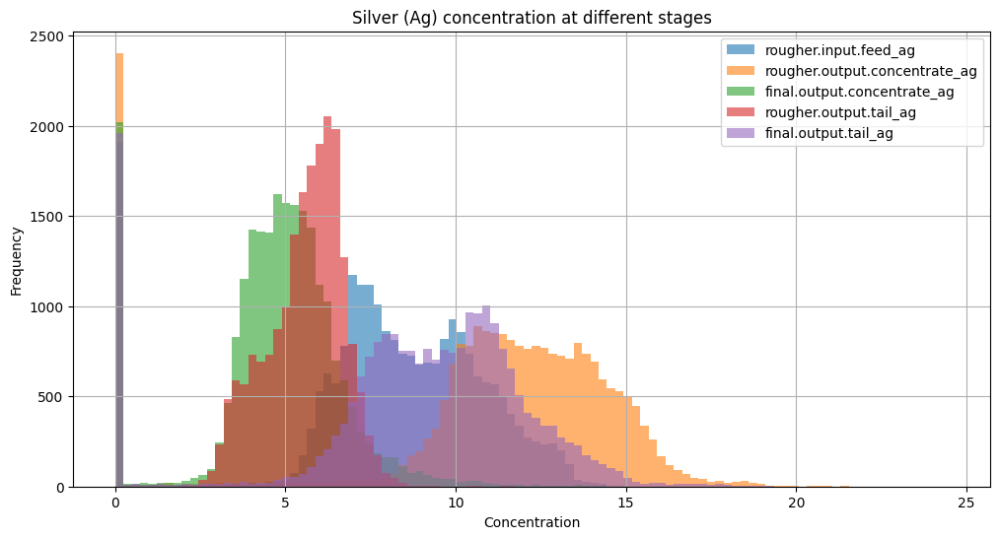

# TripleTen Project: Gold Recovery Optimization Model

## Table of Contents

- [Objective](#objective)
- [Overview](#overview)
- [Tools](#tools)
- [Highlights](#highlights)
- [Results](#results)
- [Recommendations](#recommendations)
- [Contact](#contact)
---

### Objective   
- Develope a predictive model to optimize gold recovery in a mineral extraction process using multistage data.
---

###  Overview

- We need to prepare a prototype of a machine learning model for Zyfra. 
- The model should predict the amount of gold recovered from gold ore. 
- There are two datasets on extraction and purification. 
- The model will help to optimize the production and eliminate unprofitable parameters.

---

### Tools

- Python (Pandas, NumPy, Scikit-learn)
- Matplotlib / Seaborn
- Jupyter Notebook
- import pandas as pd
- import numpy as np
- import seaborn as sns
- import matplotlib.pyplot as plt
%matplotlib inline
- from sklearn.linear_model import LinearRegression
- from sklearn import tree
- from sklearn.model_selection import train_test_split
- from sklearn.preprocessing import StandardScaler
- from sklearn.ensemble import RandomForestRegressor
- from sklearn.preprocessing import LabelEncoder
- from sklearn.metrics import make_scorer
- from xgboost import XGBRegressor
- from sklearn.model_selection import cross_val_score
- from sklearn.model_selection import GridSearchCV

---

### Highlights

As the purification process progresses, gold (Au) concentration increases significantly—from low levels in the feed to its highest in the final concentrate—indicating highly efficient recovery. Silver (Ag), on the other hand, shows only a slight increase through the stages and remains relatively high in the tailings, suggesting poor recovery. Lead (Pb) demonstrates modest concentration changes, with some recovery but a noticeable amount still ending up in the final tail. Overall, the process is clearly optimized for extracting gold, while silver and lead are recovered less effectively.

 Silver concentrate showed less seperation across stages compared to the gold process. Silver's recovery is less efficient, a large portion of silver remains, indicating lower priority or difficulty in extracting silver. Lastly, lead ceoncentration is moderate in the feed and is steady across the stages. Lead is not heavilty concentrated during the pruification process. It is not a primary foxu of recovery resulting it being less efficient to extract. 

Based on the graph above, both train set and test set curves overlapped significantly, which indicates similar distributions for being good model evaluations. 

The train and test sets overlap closely, with similar shape and range. This indicates that the primary cleaner feed size distributions are consistent between training and test datasets. Based on this datasets there are no major shifts our outliers in the test set compared to the training set. 

After analyzing the total metal concentrations at each stage (feed, rougher concentrate, and final concentrate), we observed that most values fall within a reasonable range. There are some abnormally low concentration values, which are likely the result of measurement errors or missing data.These outliers are not representative of typical process behavior and could negatively impact model training. We can remove rows where the total concentration at any stage is close to zero. This improves data quality and helps the model learn from realistic, process-valid examples.

---

### Results
- Linear Regression Weighted sMAPE: 12.38
- Random Forest Weighted sMAPE: 12.17
- XGBoost Weighted sMAPE: 12.27

We trained each model using cross-validation and calucated the wighted sMAPE, which gave 25% weight to rougher recovery and 75% to final recovery. Based on the linear regression weighted sMAPE, the models predictions were off by 12.38% from the actual values. This concludes that the model is performing an accurate measurement for predicitn ggold recovery. 

---

- sMAPE (rougher): 17.47
- sMAPE (final): 14.62
- ✅ Weighted sMAPE (final score): 15.33

---

### Recommendations

Our calculations throughout the project were accurate and aligned with the expected outcomes. Then we verified the recovery formula using Mean Absolute Error (MAE), which resulted in a near-zero error, confirming the correctness of our implementation. After that we handled missing data appropriately, ensured consistent feature sets between training and test datasets, and avoided data leakage by excluding post-process variables. The final sMAPE values showed that our model predictions were reasonably close to actual recovery values, and the weighted sMAPE calculation provided a balanced evaluation of both targets. Overall, our calculations supported a reliable, well-validated machine learning pipeline for predicting gold recovery.

### Contact
### Liam Easter
---

